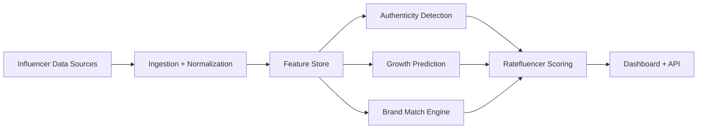
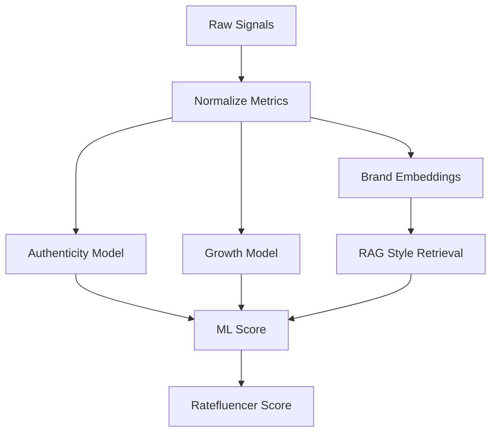
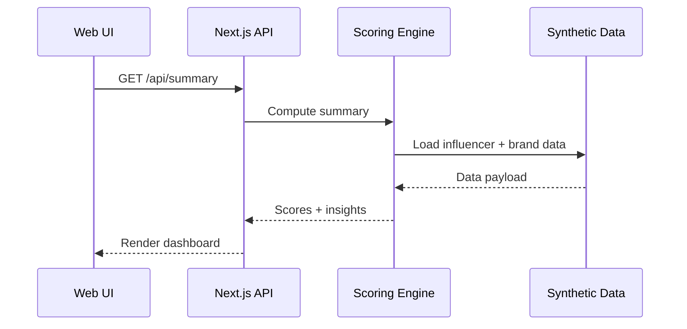

# Ratefluencer AI - Influencer Intelligence Engine

AI-powered platform that ranks creators by predicted business impact, not vanity metrics.

## Problem Statement
Brands invest billions in influencer marketing, but most selections still rely on follower counts. Ratefluencer uses ML signals to identify creators most likely to drive real campaign impact.

## What it does
- Analyze influencer profiles across engagement, audience, and content signals
- Detect fake followers, engagement pods, bots, and artificial spikes
- Predict growth across followers, engagement, and audience expansion
- Match creators to ideal brands using embeddings + similarity search
- Output a Ratefluencer Score (0-100) for campaign success potential

## Tech stack
- Next.js 16 (App Router) + TypeScript
- Tailwind CSS v4
- API routes for influencer, brand, and summary data
- Synthetic dataset for demo scoring

## Quick start
```bash
npm install
npm run dev
```

Open http://localhost:3000

## API endpoints
- GET /api/influencers
- GET /api/brands
- GET /api/summary

## Architecture diagrams

### System architecture


### AI workflow


### Data flow


## ML scoring (prototype)
We simulate a logistic regression style model using weighted features:

- Engagement rate
- Share rate
- Save rate
- Audience quality
- Posting consistency
- Growth velocity
- Comment quality
- Authenticity penalties

Formula (conceptual):

```
CampaignSuccess = sigmoid(w0 + w1*engagement + w2*share + w3*save + w4*audience + w5*growth - w6*suspicious)
RatefluencerScore = 0.28*authenticity + 0.22*growth + 0.25*brandMatch + 0.25*campaignSuccess
```

## Synthetic data
This prototype uses curated synthetic data to simulate influencer performance signals. Replace with real data connectors for production use.

## Repo structure
```
src/
	app/             # UI + API routes
	lib/             # data, scoring, utilities
```

## Deliverables checklist
- [x] Working prototype (web app)
- [x] README + setup instructions
- [x] Architecture diagrams
- [ ] Demo video (5-7 minutes)
- [ ] Presentation deck

## Roadmap
- Integrate real platform APIs
- Train ML models on historical campaign outcomes
- Add alerting for authenticity risk
- Extend brand matching with live RAG summaries
- Introduce multi-platform creator graph

## License
Hackathon prototype.
